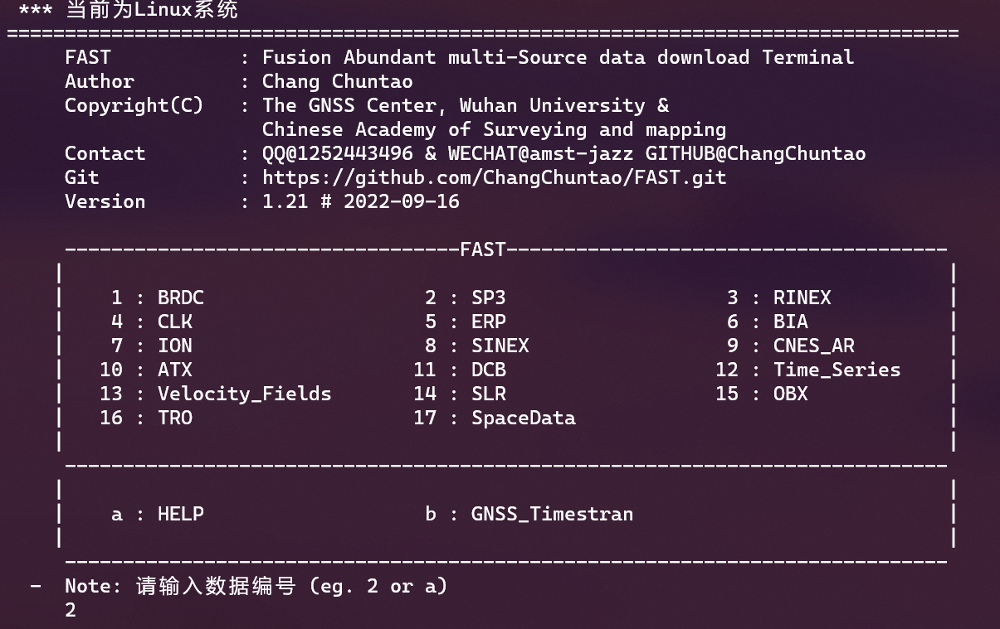
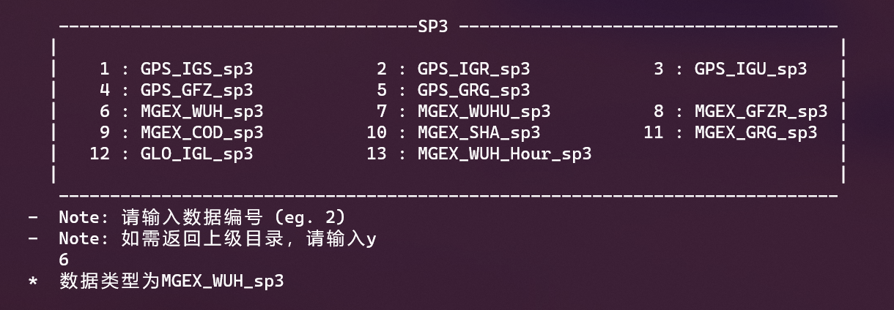
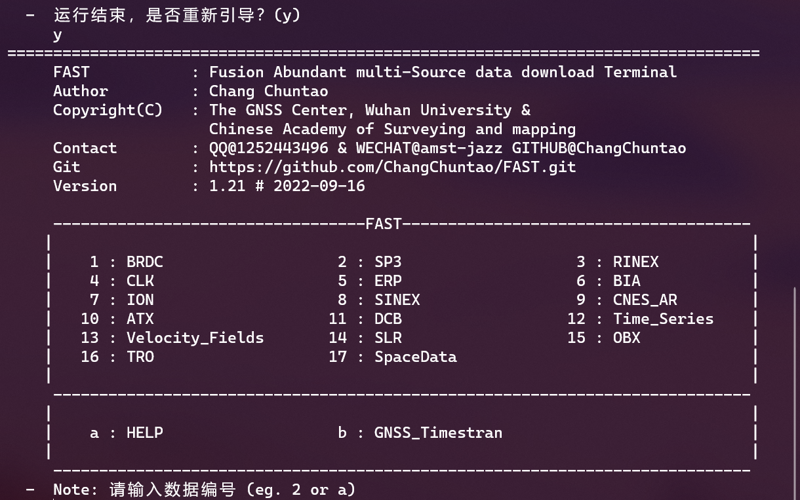

# FAST （Fusion Abundant multi-Source data download Terminal）

#### 介绍
**FAST**
针对目前GNSS数据下载步骤繁琐、下载速度慢等问题，开发了一套较为完备的融合多源数据下载终端软件——FAST。  
软件目前包含GNSS科研学习过程中绝大部分所需的数据源，采用并行下载的方式极大的提升了下载的效率。

#### Git地址
- [https://github.com/ChangChuntao/FAST](https://github.com/ChangChuntao/FAST)
- [https://gitee.com/changchuntao/FAST](https://gitee.com/changchuntao/FAST)


#### 软件特点
- **多平台**：同时支持windows与linux系统；
- **资源丰富**：基本囊括了GNSS科研学习中所需的数据源，目前支持17个大类、96个小类，具体支持数据见**数据支持**；
- **快速**：软件采用并行下载方式，在命令行参数运行模式可自行指定下载线程数，经测试下载100天的brdc+igs+clk文件只需要48.93s！
- **易拓展**：如需支持更多数据源，可在FTP_Source.py、GNSS_TYPE.py中指定所需的数据与数据源；
- **简单易行**：程序有引导下载模式与命令行带参数运行模式两种方式下载，直接运行程序便可进入引导下载模式，命令行带参数运行`FAST -h`可查看带参数运行模式介绍；
- **灵活**：在带参数运行模式下，用户可灵活指定下载类型、下载位置、下载时间、是否解压、线程数等，可根据自我需求编写bat、shell、python等脚本运行；
- **轻便**：windows程序包仅有18.9 MB，Liunx程序包仅有6.63 MB.


#### 安装教程
- **Windows系统**下仅需解压程序包即可直接运行,CMD运行`FAST.exe -h`可查看带参数运行模式介绍；
- **Linux系统**下仅需解压程序包即可直接运行,安装后如windows系统下相同可直接运行程序，或将程序配置至环境变量中。

#### 使用说明

**引导下载模式**Windows系统双击运行FAST.exe便可进入引导下载，若为Linux系统终端输入`FAST`运行即可：  
1.  以下载武汉大学多系统精密星历为例，在一级选择目录中选择SP3，即为输入2后回车；  

  
2.  选择MGEX_WUH_sp3即为输入6并回车，其中MGEX代表多系统，WUH代表武汉大学IGS数据处理中心，SP3代表精密星历；
  
  
3.  依据引导输入时间，回车完成输入；


4.  下载完成，根据提示直接回车完成解压或者输入任意字符回车不解压；


5.  根据提示输入y再次进入引导或退出；  

  
**命令行带参数运行模式**Windows系统CMD或power shell运行`FAST.exe -h`可查看命令行运行帮助，若为Linux系统终端输入`FAST -h`查看帮助：  
```
  FAST : Fusion Abundant multi-Source data download Terminal
  ©Copyright 2022.01 @ Chang Chuntao
  PLEASE DO NOT SPREAD WITHOUT PERMISSION OF THE AUTHOR !

  Usage: FAST <options>

  Where the following are some of the options avaiable:

  -v,  --version                   display the version of GDD and exit
  -h,  --help                      print this help
  -t,  --type                      GNSS type, if you need to download multiple data,
                                   Please separate characters with " , "
                                   Example : GPS_brdc,GPS_IGS_sp3,GPS_IGR_clk
  -l,  --loc                       which folder is the download in
  -y,  --year                      where year are the data to be download
  -d,  --day                       where day are the data to be download
  -o,  --day1                      where first day are the data to be download
  -e,  --day2                      where last day are the data to be download
  -m,  --month                     where month are the data to be download
  -u,  --uncomprss Y/N             Y - unzip file (default)
                                   N - do not unzip files
  -f,  --file                      site file directory,The site names in the file are separated by spaces.
                                   Example : bjfs irkj urum
  -p   --process                   number of threads (default 12)

  Example: FAST -t MGEX_IGS_atx
           FAST -t GPS_brdc,GPS_IGS_sp3,GPS_IGR_clk -y 2022 -d 22 -p 30
           FAST -t MGEX_WUH_sp3 -y 2022 -d 22 -u N -l D:\code\CDD\Example
           FAST -t MGEX_IGS_rnx -y 2022 -d 22 -f D:\code\cdd\mgex.txt
           FAST -t IVS_week_snx -y 2022 -m 1
```


#### 数据支持

1. BRDC : GPS_brdc / MGEX_brdm  
  

2. SP3 : GPS_IGS_sp3 / GPS_IGR_sp3 / GPS_IGU_sp3 / GPS_GFZ_sp3 / GPS_GRG_sp3 /   
   MGEX_WUH_sp3 / MGEX_WUHU_sp3 / MGEX_GFZR_sp3 / MGEX_COD_sp3 /   
   MGEX_SHA_sp3 / MGEX_GRG_sp3 / GLO_IGL_sp3 / MGEX_WUH_Hour_sp3


3. RINEX : GPS_IGS_rnx / MGEX_IGS_rnx / GPS_USA_cors / GPS_HK_cors / GPS_EU_cors /   
   GPS_AU_cors / MGEX_HK_cors


4. CLK : GPS_IGS_clk / GPS_IGR_clk / GPS_IGU_clk / MGEX_GFZR_clk / GPS_GRG_clk /   
   GPS_IGS_clk_30s / MGEX_WUH_clk / MGEX_COD_clk / MGEX_GFZ_clk / MGEX_GRG_clk /  
   WUH_PRIDE_clk /MGEX_WUHU_clk / MGEX_WUH_Hour_clk


5. ERP : IGS_erp / WUH_erp / COD_erp / GFZ_erp/ IGR_erp/ WUHU_erp / WUH_Hour_erp


6. BIA : MGEX_WHU_ABS_bia / MGEX_WHU_OSB_bia / GPS_COD_bia / MGEX_COD_bia /   
   MGEX_GFZ_bia


7. ION : IGSG_ion / IGRG_ion / WUHG_ion / WURG_ion / CODG_ion / CORG_ion / UQRG_ion   
   UPRG_ion / JPLG_ion / JPRG_ion / CASG_ion / CARG_ion / ESAG_ion / ESRG_ion


8. SINEX : IGS_day_snx / IGS_week_snx / IVS_week_snx / ILS_week_snx / IDS_week_snx


9. CNES_AR : CNES_post / CNES_realtime


10. ATX : MGEX_IGS_atx   
   

11. DCB : GPS_COD_dcb / MGEX_CAS_dcb / MGEX_WHU_OSB / P1C1 / P1P2 / P2C2  


12. Time_Series : IGS14_TS_ENU / IGS14_TS_XYZ / Series_TS_Plot  


13. Velocity_Fields : IGS14_Venu / IGS08_Venu / PLATE_Venu  


14. SLR : HY_SLR / GRACE_SLR / BEIDOU_SLR  


15. OBX : GPS_COD_obx / GPS_GRG_obx / MGEX_WUH_obx / MGEX_COD_obx /  
    MGEX_GFZ_obx / MGEX_WUHU_obx


16. TRO : IGS_zpd / COD_tro / JPL_tro / GRID_1x1_VMF3 / GRID_2.5x2_VMF1 / GRID_5x5_VMF3   


17. SpaceData : SW_EOP


#### 参与贡献

1. **常春涛**博士@武汉大学  
    程序思路、主程序编写、文档编写、程序测试

2. **蒋科材**博士后@武汉大学   
    程序思路、并行计算处理思路

3. **慕仁海**博士@武汉大学  
    程序思路、程序编写、程序测试

4. **李博**博士@辽宁工程技术大学&中国测绘科学研究院  
    程序测试、文档编写、节点汇总

5. **李勇熹**@兰州交通大学&中国测绘科学研究院  
    程序测试、节点汇总

6. **曹多明**@山东科技大学&中国测绘科学研究院  
    程序测试、节点汇总
