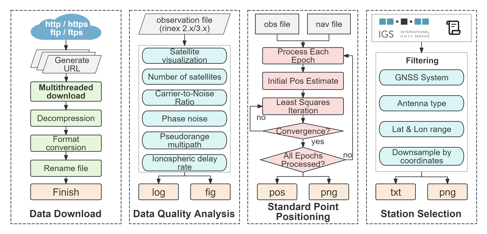

<!-- 
  ╔═══════════════════════════════════════════════════════════════════════════╗
  ║                         FAST GNSS TOOLKIT                                 ║
  ║              File Download and Signal Processing Toolkit                  ║
  ╚═══════════════════════════════════════════════════════════════════════════╝
-->

<div align="center">

<h1>File Download and Signal Processing Toolkit for GNSS</h1>

<p>
  <a href="https://github.com/ChangChuntao/FAST/releases/tag/v3.01.0">
    
  </a>
  <a href="https://www.python.org/downloads/">
    
  </a>
  <a href="LICENSE">
    
  </a>
</p>

<p>
  
  
  
</p>

<p><em>A comprehensive GNSS data processing solution by GNSS Research Center, Wuhan University</em></p>

<p>
  <b><a href="#-quick-start">🚀 Quick Start</a></b> •
  <b><a href="#-features">✨ Features</a></b> •
  <b><a href="#-download">📥 Download</a></b> •
  <b><a href="#-documentation">📖 Docs</a></b>
</p>

</div>


## 🎯 Overview



<div align="center">

| 📌 Version | 🏢 Organization | 🐍 Language | 🖥️ Interface |
|:----------:|:---------------:|:-----------:|:------------:|
| **v3.01.00** | GNSS Research Center, Wuhan University | Python 3.12+ | GUI + CLI |

</div>


---

## 🚀 Quick Start

### 📥 Download Pre-built Binaries

<div align="center">

<table>
<thead>
<tr>
<th>Platform</th>
<th>GUI Version 📦</th>
<th>CLI Version 🖥️</th>
</tr>
</thead>
<tbody>
<tr>
<td><b> Windows</b></td>
<td><a href="https://github.com/ChangChuntao/FAST/releases/download/v3.01.0/FastQt_Win.zip">FastQt_Win.zip</a></td>
<td><a href="https://github.com/ChangChuntao/FAST/releases/download/v3.01.0/FAST_Win.zip">FAST_Win.zip</a></td>
</tr>
<tr>
<td><b> macOS (Intel)</b></td>
<td><a href="https://github.com/ChangChuntao/FAST/releases/download/v3.01.0/FastQt_Mac.zip">FastQt_Mac.zip</a></td>
<td><a href="https://github.com/ChangChuntao/FAST/releases/download/v3.01.0/FAST_Mac.zip">FAST_Mac.zip</a></td>
</tr>
<tr>
<td><b> Ubuntu</b></td>
<td>—</td>
<td><a href="https://github.com/ChangChuntao/FAST/releases/download/v3.01.0/FAST_Ubuntu.zip">FAST_Ubuntu.zip</a></td>
</tr>
<tr>
<td><b> CentOS</b></td>
<td>—</td>
<td><a href="https://github.com/ChangChuntao/FAST/releases/download/v3.01.0/FAST_CentOS.zip">FAST_CentOS.zip</a></td>
</tr>
</tbody>
</table>

</div>

### 🐍 Run from Source

<details>
<summary><b>🐧 Linux / 🍎 macOS</b></summary>

```bash
# 1. Clone repository
git clone https://github.com/ChangChuntao/FAST.git && cd FAST

# 2. Setup environment
python -m venv venv
source venv/bin/activate
pip install -r requirements.txt

# 3. Run
python fast/_fast.py      # CLI
python fast/_fastQt.py    # GUI
```
</details>

<details>
<summary><b>🪟 Windows</b></summary>

```batch
:: 1. Clone repository
git clone https://github.com/ChangChuntao/FAST.git && cd FAST

:: 2. Setup environment
python -m venv venv
venv\Scripts\activate
pip install -r requirements.txt

:: 3. Run
python fast\_fast.py      :: CLI
python fast\_fastQt.py    :: GUI
```
</details>

---

## ✨ Features

### 📥 Data Download `fast/download/`

| Feature | Description |
|:--------|:------------|
|  **Multi-threaded** | Concurrent downloads with automatic queue management |
|  **Smart Detection** | Intelligent duplicate detection and file validation |
|  **Auto Processing** | Decompress, convert, concatenate, rename automatically |
|  **Data Types** | BRDC · SP3 · CLK · OBS · ERP · DCB/OSB · ION/TRO products · SINEX |

### 🔍 Quality Analysis `fast/qc/`

| Module | Function | File |
|:-------|:---------|:-----|
|  Satellite Stats | Observation counts and availability | `satNum.py` |
|  Noise Analysis | Pseudorange & carrier phase noise | `noise.py` / `CNR.py` |
|  Cycle Slip | Detection and statistics | `cycleSlip.py` |
|  IOD | Ionospheric delay variation rates | `IOD.py` |
|  Multipath | Turboedit multipath calculation | `multipath.py` |
|  CMC | Code-minus-carrier computation | `CMC.py` |
|  High-order Diff | Difference analysis | `highOrderDiff.py` |

### 📍 SPP Positioning `fast/spp/`

| Capability | Details |
|:-----------|:--------|
|  Algorithm | Dual-frequency ionosphere-free pseudorange positioning |
|  GNSS Systems | GPS + BDS + Galileo support |
|  Export | Multiple output formats |

### 🗺️ Station Selection `fast/site/`

| Feature | Description |
|:--------|:------------|
|  Filters | GNSS system · Antenna/Receiver · Geographic bounds · Sampling rate |
|  Visualization | Interactive map interface |
|  Downsampling | Large dataset reduction (`thinning.py`) |

---

## 📁 Project Structure

```
FAST/
├── fast/                    # Source code
│   ├── _fast.py           # CLI entry
│   ├── _fastQt.py         # GUI entry
│   │
│   ├── com/               # Common utilities
│   │   ├── pub.py            # Common functions
│   │   ├── gnssParameter.py  # GNSS parameters
│   │   ├── gnssTime.py       # Time conversions
│   │   ├── readNav.py        # Navigation files
│   │   ├── readObs.py        # Observation files
│   │   └── xyz2blh.py        # Coordinate transforms
│   │
│   ├── download/           # Download module
│   │   ├── mode.py           # Main controller
│   │   ├── download.py       # Core logic
│   │   ├── ftpSrc.py         # FTP sources
│   │   └── arg.py            # CLI arguments
│   │
│   ├── qc/                 # Quality check module
│   ├── spp/                # SPP module
│   ├── site/               # Station selection
│   ├── qt/                 # PyQt5 GUI
│   ├── plot/               # Plotting utilities
│   └── build/              # Build outputs
│
├── 📖 manual/                  # Documentation
├── 📂 sample_data/             # Example data
└── 📦 release/                 # Distributions
```

---

## 🔧 Installation

### Requirements

<div align="center">

| Package | Purpose | Version |
|:--------|:--------|:-------:|
| Python | Core runtime | 3.12+ |
| PyQt5 | GUI framework | — |
| numpy | Numerical computing | — |
| matplotlib | Plotting | — |
| cartopy | Map visualization | — |
| qdarkstyle | Dark theme | — |
| qbstyles | Plot styles | — |

</div>

```bash
pip install -r requirements.txt
```

---

## 📦 Key Modules

### CLI Controller (`fast/download/mode.py`)

```python
runApplication()         # Interactive mode
runApplicationWithArgs() # Command-line mode
```

### SPP Positioning (`fast/spp/sppbybrdc.py`)

```python
spp()           # Broadcast ephemeris positioning
sppLsq()        # Least squares solver
writePosData()  # Export results
```

### Common Utilities (`fast/com/pub.py`)

```python
printFast()     # Formatted output
printPanda()    # Timestamped logging
mkdir()         # Directory creation
rms()           # Root mean square
```

---

## 📊 Data Type Indexing

| Index | Format | Example |
|:------|:-------|:--------|
| `yd_type` | Year + Day of Year | `2025 001` |
| `yds_type` | Year + DOY + Station | `2025 001 WUH0` |
| `ym_type` | Year + Month | `2025 01` |
| `s_type` | Station only | `WUH0` |
| `no_type` | No time index | — |
| `ydh_type` | Year + DOY + Hour | `2025 001 12` |
| `ydsh_type` | Year + DOY + Station + Hour | `2025 001 WUH0 12` |

---

## 📝 Version History

<div align="center">

| Version | Date | Status | Notes |
|:-------:|:----:|:------:|:------|
| **3.01.00** | 2026-03-17 | 🟢 Current | Bug fixes |
| **3.00.03** | 2025-08-02 | 🟢 Stable | Stable release |
| **3.00.02** | 2024-05-22 | 🟡 Legacy | Bug fixes |
| **3.00.01** | 2024-01-09 | 🟡 Legacy | Major v3 update |
| **2.11** | 2023-09-20 | 🔴 Legacy | Previous stable |

</div>

> See [`fast/com/pub.py`](fast/com/pub.py) for complete history.

---

## 👥 Development Team

<div align="center">

<table>
<thead>
<tr>
<th>Role</th>
<th>Name</th>
<th>Affiliation</th>
</tr>
</thead>
<tbody>
<tr>
<td> <b>Project Lead</b></td>
<td>Dr. Chang Chuntao</td>
<td>Wuhan University</td>
</tr>
<tr>
<td> <b>Algorithm</b></td>
<td>Prof. Jiang Kecai</td>
<td>Wuhan University</td>
</tr>
<tr>
<td> <b>Core Dev</b></td>
<td>Dr. Mu Renhai</td>
<td>Wuhan University</td>
</tr>
<tr>
<td> <b>QA</b></td>
<td>Prof. Li Bo</td>
<td>Liaoning Technical University</td>
</tr>
<tr>
<td>🔧 <b>Support</b></td>
<td>Dr. Wei Hengda</td>
<td>Wuhan University</td>
</tr>
</tbody>
</table>

</div>

---

## 📖 Documentation

- 📄 [Complete Manual](./manual/FAST_manual-V3.00.pdf)
- 🐛 [Issue Tracker](https://github.com/ChangChuntao/FAST/issues)

---

## 📧 Contact

<div align="center">

**Dr. Chang Chuntao** — chuntaochang@whu.edu.cn

GNSS Research Center, Wuhan University

</div>

---

<div align="center">

<p>
  <a href="https://github.com/ChangChuntao/FAST">🐙 GitHub</a> •
  <a href="https://gitee.com/changchuntao/FAST">🔗 Gitee</a>
</p>

<p>
  
  
</p>

<sub>Made with ❤️ by GNSS Research Center, Wuhan University</sub>
<br>
<sub>© 2024-2026 FAST Development Team</sub>

</div>