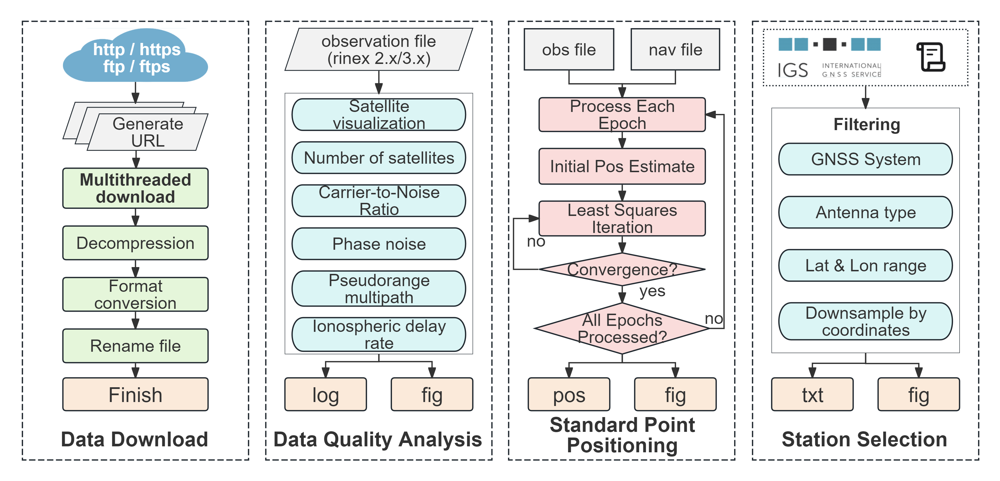

# FAST （File Download and Signal Processing Toolkit for GNSS）

#### Introduce
**FAST** is a GNSS data download and processing software developed in Python 3.12, designed to ensure high flexibility and seamless integration with other scientific computing tools. The software adopts a modular architecture, consisting of four main components: (1) data download, (2) quality analysis, (3) SPP, and (4) station selection. Built on PyQt5, FAST provides both a GUI and command-line support, making it accessible to users ranging from beginners to advanced researchers.

#### Git
- [https://github.com/ChangChuntao/FAST](https://github.com/ChangChuntao/FAST)
- [https://gitee.com/changchuntao/FAST](https://gitee.com/changchuntao/FAST)

#### Software features
- **Data download module**: This module enables multi-threaded downloading of GNSS data, followed by automated processes such as decompression, format conversion, file concatenation, and renaming. The software efficiently checks for duplicate files locally, ensuring high efficiency and robustness;
- **Quality analysis module**: This module performs comprehensive quality analysis of GNSS data. By simply inputting RINEX files, users can analyze key metrics such as satellite observation counts, pseudorange and carrier phase noise, cycle slip ratios, and ionospheric delay variation rates;
- **Fast**: The software adopts parallel download mode, and the number of download threads can be specified in the command line parameter operation mode. After testing, it only takes 48.93s to download the 100 days BRDC+IGS+CLK file!
- **SPP module**: Supporting dual-frequency ionosphere-free pseudorange positioning for GPS, BDS, and Galileo systems, this module offers a user-friendly interface with straightforward operations, making it ideal for beginners;
- **Station selection module**: This module allows users to select stations based on satellite system, antenna type, geographic range, and downsampling settings, providing an intuitive interface for efficient station selection.

#### Installation tutorial

For detailed installation and usage instructions, please refer to the FAST_manual-V3.00.docx document included in the ./manual directory.

#### Participation and contribution

1. Dr. **Chang Chuntao** @GNSS Research Center, Wuhan University
    Program design/ Program writing/ Document writing/ Program testing/ Program maintenance     
    

2. Pd. **Jiang Kecai**@GNSS Research Center, Wuhan University
    Program idea / parallel computing processing idea
  

3. Dr. **Mu Renhai**@GNSS Research Center, Wuhan University
    Program design/ program testing/ Documentation

4. Dr. **Li Bo** @Liaoning Technical University
    Program testing/ Documentation

5. Dr. **Wei Hengda** @GNSS Research Center, Wuhan University
    Program testing/ Documentation